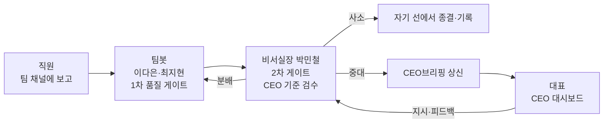

# agent-bogo — 사내 보고 자동 상향 시스템

> 물리적으로 분리된 사내 3개 망에서, 직원의 보고가 **사람 손을 거치지 않고**
> 팀봇 → 비서실장 → 대표 대시보드로 자동 상향되는 **사내 전용** 멀티에이전트 시스템.
> 공인 IP 0 · 직원 PC 설치 0 · 수동 네트워크 설정 0. 인터넷 노출 0.

---

## 무엇을 푸는가

같은 건물 안에 **물리적으로 분리된 회사망 3개(A/B/C)** 가 있고, 직원들의 일상 보고가
메신저·메일·구두로 흩어져 대표에게 닿기까지 여러 사람의 손을 탄다. 이 과정에서
누락·지연·품질 편차가 생긴다.

agent-bogo 는 이 흐름을 **자동화**한다. 직원이 자기 팀 채널(Mattermost)에 보고를 올리면,
팀봇이 1차로 품질을 검수하고, 비서실장 봇이 2차로 CEO 기준에 맞춰 다시 검수해, 사소한 건은
스스로 종결하고 중대한 건만 CEO 브리핑으로 상신한다. 대표는 채널을 일일이 돌아다니지 않고
**브라우저 한 곳(CEO 대시보드)** 에서 부서 현황을 보고 지시를 내린다.

서버 **1대**(NIC 3장 직결)가 분리된 3개 망을 동시에 받으며, 공인 IP 없이 사내망 안에서만 돈다.
운영자는 랜선을 꽂고 런처를 더블클릭하면 된다 — NIC 자동 감지 → `.env` 자동 생성 → 기동까지
한 번에 끝난다.

---

## 보고 흐름



- **1차 게이트(팀봇)** — 인사총무팀은 `이다은`, 개발팀은 `최지현` 봇이 담당. 자기 팀 채널의
  보고를 받아 품질을 1차 검수하고 보고라인으로 올린다.
- **2차 게이트(비서실장 `박민철`)** — 양 보고라인의 팀 보고를 다시 검수해, 미흡분은 담당
  에이전트에게 반려하고, 통과분을 **루틴(자기 선 종결·기록)** 과 **특이사항(CEO브리핑 상신)** 으로 분기한다.
- **하향** — CEO 지시·피드백은 비서실장이 받아 각 팀으로 분배한다.

세 봇 모두 LLM 두뇌로 **매 메시지마다 "내 차례인가 + 무엇을 할까"** 를 자율 판단한다.
라우팅·페르소나·규칙은 파이썬이 아니라 데이터(`teams.json`/`channels.json`/`agents/*.md`)로 선언된다.

---

## 핵심 특징

- **멀티홈 NIC 자동 감지 · 자동 프로비저닝** — `net_autodetect.py` 가 물리 NIC와 사설 IP(RFC1918)를
  읽어 모드를 판정(사설 NIC 2개↑=멀티홈 / 1개=단일망 LAN / 0개=루프백)하고 `.env` 네트워크 키를
  **멱등 자동 기록**한다. 비밀·수동값은 절대 덮어쓰지 않는다.
- **공인 IP 0 · 설치 0 · 수동 설정 0** — Mattermost·봇·관리자·채널·토큰을 `provision_mm.py` 가
  무인 멱등 생성·발급한다. 직원 PC에 설치할 것이 없고(브라우저만), 운영자는 더블클릭만 한다.
- **망분리 보안 가드** — 공인 NIC가 하나라도 감지되면 `0.0.0.0` 자동 활성을 중단·경고한다
  (인터넷 노출 방지). 와일드카드 바인딩은 멀티홈 모드 외에는 거부되고 루프백으로 강등된다.
- **채널 / 메모리 / vault 격리(코드 강제 + 테스트)** — 학습방·메모리·vault가 역할별로 격리되며,
  격리 위반을 막는 테스트가 함께 있다(`test_channel_isolation.py`·`test_memory_isolation.py` 등,
  전체 **228개** 테스트).
- **LLM 두뇌 · 역할별 세션 격리** — Nous Research `hermes-agent` 런타임 위에서 각 봇이 독립
  세션으로 동작한다. 두뇌 백엔드는 클라우드(OpenRouter, 기본 DeepSeek V4 Flash) 또는
  **로컬(Ollama 등, API 키 불필요)** 을 `.env` 한 줄로 전환한다.

---

## 빠른 시작

### 1) 가져오기

```bash
git clone <repo-url> agent-bogo
cd agent-bogo
```

### 2) 더블클릭으로 시작 (가장 쉬운 길)

프로젝트 루트의 런처를 OS에 맞게 더블클릭한다. 루트 파일은 `launchers/` 의 실제 런처로 위임하는 얇은 래퍼다.

| OS | 더블클릭할 파일 | 내부 동작 |
|----|----------------|-----------|
| macOS | `BOGO_start.command` | `launchers/BOGO_start.command` → `app/bogo_ctl.sh` |
| Windows | `BOGO_start.bat` | `launchers\BOGO_start.bat` → `app\bogo_ctl.ps1` |
| Linux | `launchers/BOGO_start.sh` | `app/bogo_oneclick.sh start`(풀 코어) |

- 미설치 상태면 → 자동으로 venv + 의존성 + config 복사 + 상시 가동 등록까지 수행한다.
- 이미 가동 중이면 → 중복 없이 최신 코드 재배포 + 역할 재시작만 한다.
- Linux는 앱 메뉴 아이콘 설치(`./app/install_desktop_launcher.sh`)를 한 번 하면 메뉴에서 클릭 실행된다.
- 더블클릭이 막히면 터미널에서 (경로에 공백이 있을 수 있으니 따옴표 권장):

  ```bash
  bash "/실제/경로/launchers/BOGO_start.sh"
  ```

### 3) 터미널로 시작 (서버·헤드리스)

```bash
cd app
./bogo_ctl.sh setup      # 통신 백본(Mattermost+Postgres) 보장 → venv+의존성+config → 상시 가동 등록
# setup 안내대로 .env 값(필요 시) 입력 후
./bogo_ctl.sh restart
```

Windows(PowerShell): `pwsh ./bogo_ctl.ps1 setup` → `pwsh ./bogo_ctl.ps1 restart`

> **Python 3 필요**(버전 강제·체크 없음 — `python3`(없으면 `python`)을 찾아 그대로 venv 구성). Docker가 동작해야 통신 백본이 선다
> (macOS는 Colima 또는 Docker Desktop, Linux는 `docker.io`+compose, Windows는 Docker Desktop).
> 통신 백본만 직접 올리려면 `cd app && docker compose up -d`.

---

## 네트워크 배포

세 망/여러 PC가 한 중앙 서버를 공유하는 층간 모드는 **3가지 연결 방식**을 지원한다.
세 방식 모두 외부(인터넷) 노출은 0이다.

| 방식 | 언제 | 외부 노출 |
|------|------|-----------|
| **멀티홈(다중 NIC 직결)** — 권장 | 물리 분리된 사내망이 같은 건물, 서버실 랜선 포설 가능 | 0 (공인 NIC 부재 + 방화벽 이중 가드) |
| Tailscale 메시 VPN — 대안 | 망이 흩어져 있거나 재택 포함, 랜선 포설 불가 | 0 (사설 메시) |
| 같은 LAN 직결 — 대안 | 모든 PC가 같은 공유기/스위치 | 0 (사내 LAN 한정) |

멀티홈 흐름: `A/B/C 망 직원 브라우저(자기 망 NIC IP)` → `중앙 서버 1대(NIC 3장 + Mattermost + 팀봇/CEO봇 두뇌)` → `대표 브라우저(CEO 대시보드)`.

**상세 배선(멀티홈 NIC/SiteURL/방화벽, Tailscale/LAN, 직원 계정 발급, 연결 점검)은
[`app/docs/DEPLOY_NETWORK.md`](app/docs/DEPLOY_NETWORK.md) 를 참고한다.** 시스템 아키텍처·에이전트 정의·
대시보드 등 내부 설계 문서는 [`app/docs/README.md`](app/docs/README.md) 에 있다.

---

## 보안

- **인터넷 노출 0** — 기본 바인딩은 `127.0.0.1` 루프백 전용. 멀티홈에서만 `0.0.0.0` 으로 3개 NIC를
  동시에 받으며, 이는 서버에 공인 NIC가 없다는 전제 위에서만 허용된다.
- **공인 NIC 가드** — 공인(글로벌 라우팅) IP를 가진 NIC가 감지되면 와일드카드 자동 활성을 중단하고
  경고한다. `*` 바인딩은 어떤 모드에서도 거부된다.
- **망분리 가드** — 멀티홈에서 IP forwarding(`ip_forward` off + `FORWARD DROP`)으로 A/B/C 망 간
  교차 트래픽을 차단한다(`net_autodetect.py segregation` 으로 진단).
- **데이터 격리** — 채널·메모리·vault가 역할별로 격리되며, 격리 계약을 코드와 테스트로 강제한다.
- **시크릿 비커밋** — `.env`·`*_config.json`·`channels.json` 은 `.gitignore` 로 차단된다.
  부트스트랩이 `*.example` 을 없을 때만 복사하고, 봇 토큰은 프로비저닝이 자동 발급한다.

---

## 디렉토리 구조

```
agent-bogo/
├─ BOGO_start.command       # macOS 더블클릭 진입점(→ launchers/)
├─ BOGO_start.bat           # Windows 더블클릭 진입점(→ launchers/)
├─ BOGO_start.sh            # 공용 래퍼(→ launchers/BOGO_start.sh)
├─ launchers/               # 실제 더블클릭 런처(시작/정지/백업, mac·win·linux)
├─ README.md                # 이 문서
└─ app/                     # 애플리케이션 본체
   ├─ bogo_runtime.py       #   팀봇/오케스트레이터 런타임(진입점)
   ├─ bogo_brain.py         #   LLM 두뇌(판단·라우팅 추론)
   ├─ ceo_dashboard.py      #   CEO 대시보드 웹앱
   ├─ ceo_admin_runtime.py  #   에이전트 개조(학습방) 런타임
   ├─ net_autodetect.py     #   NIC 자동 감지 → .env 멱등 주입
   ├─ provision_mm.py       #   Mattermost 무인 프로비저닝(관리자·봇·채널·토큰)
   ├─ bogo_ctl.sh / .ps1    #   단일 진입 컨트롤러(setup/restart/status/...)
   ├─ bogo_oneclick.sh      #   풀 코어 원클릭 기동
   ├─ bootstrap.sh / .ps1   #   venv + 의존성 + config 부트스트랩
   ├─ docker-compose.yml    #   통신 백본(Mattermost + Postgres)
   ├─ teams.json            #   선언적 팀·라우팅(팀방·보고라인·협업방·학습방)
   ├─ agents/               #   에이전트 정의(orchestrator·hr·dev + _shared 공통규칙)
   ├─ config/               #   *.example 설정 템플릿
   ├─ service/              #   OS별 상시 가동 서비스 템플릿(launchd/systemd/Task)
   ├─ tests/                #   테스트(채널·메모리 격리, 네트워크 바인딩 등)
   ├─ vault/                #   로컬 RAG vault(보고·피드백·시스템 노트)
   └─ docs/                 #   DEPLOY_NETWORK.md · README.md(상세 설계)
```

---

## 기술 스택

- **언어 / 런타임** — Python 3 (버전 체크 없음; ARM64 포함, 추가 빌드 도구 없이 `pip install` 동작)
- **두뇌** — Nous Research `hermes-agent==0.17.0` (AIAgent 런타임), 모델은 OpenRouter DeepSeek V4 Flash(기본) 또는 로컬 Ollama 등 OpenAI 호환 서버
- **메시징** — Mattermost (WebSocket 수신 + REST 게시), `websockets>=15.0`
- **인프라** — Docker / Docker Compose (Mattermost + Postgres), 멀티홈 NIC 직결
- **로컬 RAG** — SQLite FTS5(표준 라이브러리) + 선택적 `sentence-transformers`(all-MiniLM-L6-v2, 오프라인) · `numpy`
- **상시 가동** — macOS launchd / Linux systemd(`--user`) / Windows Task Scheduler

---

## 라이선스

사내 전용 프로젝트로, 별도 공개 라이선스를 두지 않는다.
